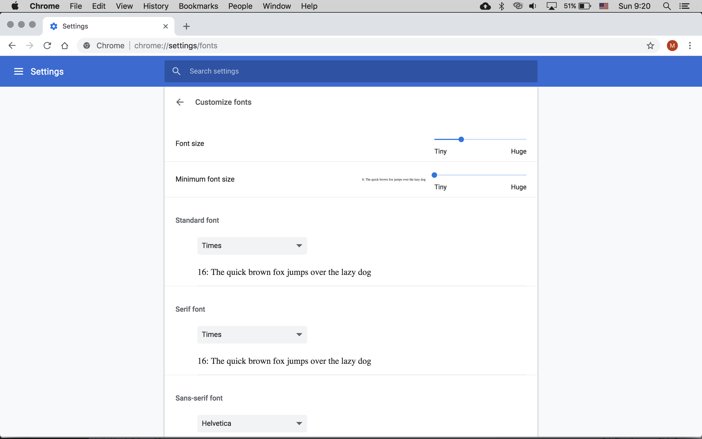
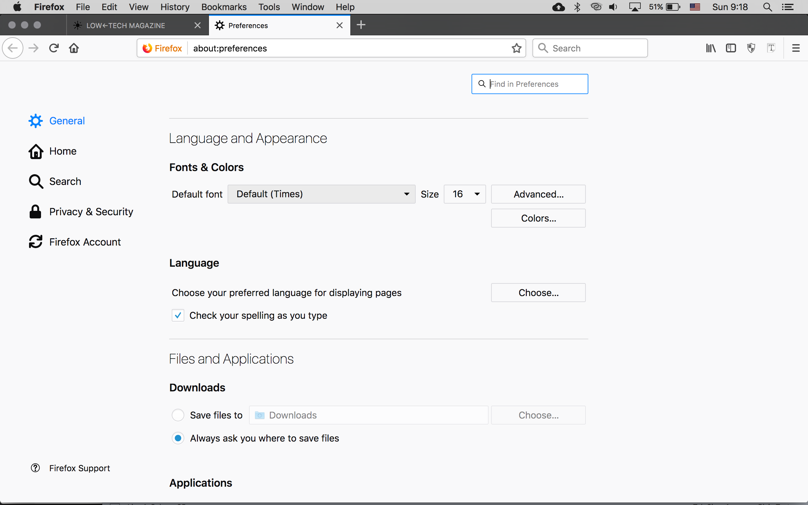
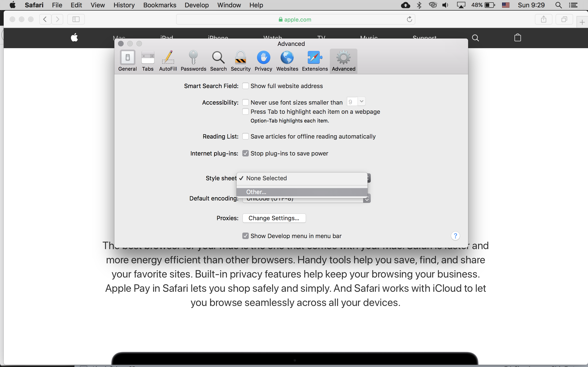
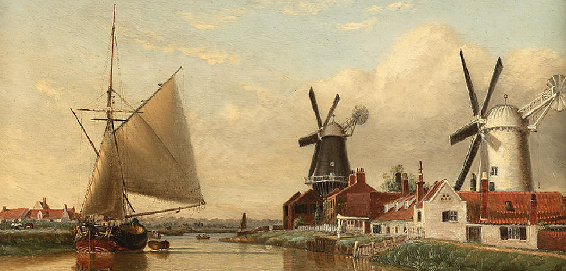
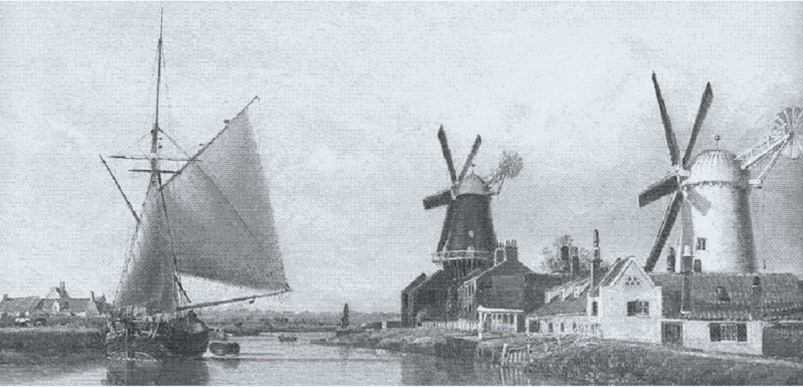
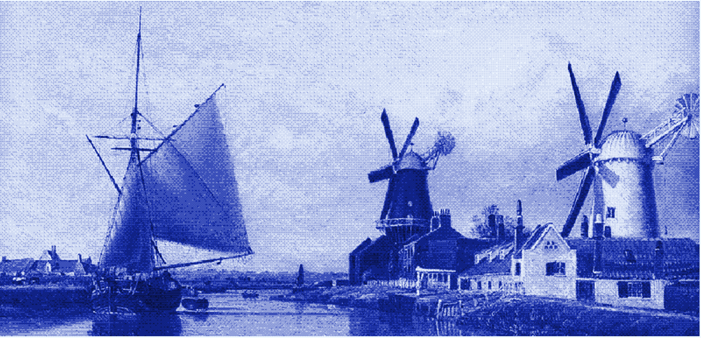

# How to Build a Low-tech Website: Design Techniques and Process
Marie Otsuka

Low-tech Magazine is a technology website that looks at sustainable historical alternatives to modern-day tech. In the summer of 2017, Lauren Traugott-Campbell and I received a grant from the Maharam Foundation to work with Low-tech Magazine's creator/chief editor, Kris De Decker, to redefine its design. The project provoked an interesting question: what does it mean to design a sustainable website? Together with Roel Roscam Abbing, Rotterdam-based artist and researcher, we developed a website that radically reduced the energy used to access its content. It recently launched at [solar.lowtechmagazine.com](https://solar.lowtechmagazine.com/).

This article focuses on the processes and front-end efforts involved in this project, and is a compendium to [How to Build a Low-tech Website](https://solar.lowtechmagazine.com/2018/09/how-to-build-a-lowtech-website.html), which summarizes our primary design decisions and motivations, and [How to build a Low-Tech website: Software & Hardware](https://homebrewserver.club/low-tech-website-howto.html), which documents the back-end technical details. It's written as an introductory text for those with basic knowledge of front-end languages (HTML, CSS, JS.)

Part 1 reviews some specific techniques used in the design. Part 2 delves into how we used a static site generator to redesign the whole website development process.

# Part 1: Design

A core part of the design process was to interrogate which design elements and features can be sacrificed and which are absolutely necessary for the site's purposes. What kind of changes in user experience can question our relationship to the internet, while still being functional? 

In considering internet sustainability, the design of a website constitutes the majority of energy use. "[F]rontend components—JavaScript, images, CSS/ HTML, and other assets, plus page rendering tasks a browser must perform—comprised between 76 to 92% of total page load time. Because design decisions drive so much of what happens on the frontend, designers clearly have a critical role to play in creating optimized solutions." (Tim Frick, Designing for Sustainability.) Considering this, our design approach was to prioritize using the least amount of resources to enable a website that can be powered from a small-scale solar panel.


## Logo

Low-tech’s mission is to look to technologies of past for inspiration for our future. In keeping with their approach, we decided on a simple typographic move instead of a logo: a left-facing arrow as the hyphen. LOW←TECH MAGAZINE, in all forms it takes across platforms, is our identity. The arrow also draws from Low-tech’s previous image masthead of a spear, as a low-tech weapon against prevailing the claims of high-tech progress.

Specifically, it uses the unicode: `&larr;` or `U+02190`, which, if not included in the default typeface, will use any symbol font available to the user to render it. 

As some have noted, it’s possible to embed inline SVGs with minimal overhead on websites, since SVGs are a scalable and lightweight image format. But once a logotype is set in vector form, it needs to be distributed accordingly. Logos are now required for any form of representation, often involving a zipped package with eps, ai, png, and jpeg files all in order to ensure that the end-user has a program to use at least one of them. (If you think about it, using a letter / symbol is the equivalent of inline SVGs in print form...)

This approach avoids the need to distribute these assets but also strengthens the identity as a versatile, medium-specific voice. The identity calls for conceptual consistency over visual uniformity.


## Default typeface

In the early decades of the web, we only saw system fonts used on the web. The so-called system fonts such as Arial, Times New Roman, Georgia, and Verdana were most likely to be available on all operating systems, whether Windows / Mac or other. This ensured that the website will more or less look consistent for the majority of users. 

Now, with the `@font-face` rule and webfont distributors, it's extremely easy to embed a typeface within a website. (In fact, this has unintentionally led to enabling mass piracy of typefaces.) But they come at a cost: custom fonts impact performance, often adding several seconds of load time to a page. Several strategies by name of [FOUT, FOIT, or FOFT](https://css-tricks.com/fout-foit-foft/) address this issue.

With customized typefaces all over the web, it's often easy to overlook that even before the website's CSS kicks in, the "user-agent" stylesheet, or your browser settings, applies styles to the website. One of the first things we realize as front-end designers is that all the website-specific styling we see is simply overriding these browser defaults.

This design leverages these defaults, not only to avoid having to load more assets, but also to reiterate the role of the browser in website access. Furthermore, only one weight (regular) of a font is used, demonstrating a content hierarchy that can be established without loading multiple typefaces and weights. 

This empowers the user to customize the look / feel to their own choosing: if users dislike the typeface displayed on the site, they can go into their browser settings to change this. Below are screenshots of this process in commonly used browsers.

#### Chrome
Go to Settings, and scroll down to Appearance, then select Customize Fonts `chrome://settings/fonts`



#### Firefox
Go to Preferences, and in General, scroll to Language and Appearance to see Fonts & Colors  `about:preferences`



#### Safari
It looks like newer version of Safari have removed the font customization feature, which used to be in the Appearance tab of Preferences. The latest version barely has any out-of-the box controls, although it looks like it allows you to use your own stylesheet if you know CSS.
	



## Images

### Dithered images
Instead of using full-color high-resolution images, we chose to convert all images to black and white, with 4 levels of gray in-between. See Roel's [dithering plugin](https://homebrewserver.club/low-tech-website-howto.html#image-compression) for more details on this conversion.

As several readers have noted, certain images are better suited for other forms of compression. But our goal was to not only compress images, but also to call to attention this act of compression. And considering that the majority of Kris' articles feature archival black and white imagery, compressing into a file format with indexed color (in which the number of colors determines its weight) was most appropriate for the limited color palette.

Moreover, we found that dithered images can be stretched beyond their actual image size to emphasize its distinct aesthetic, and that these artifacts of compression can become an integral part of the design. 

It's common practice today to generate multiple sizes of the same image in order to display the appropriate size for the platform (desktop, tablet, mobile.) Here, however, we opted to use the same image file for both thumbnail and featured images to prioritize the browser's cache of the loaded image, even if it means that the initial listing pages may be a bit heavier.

These black and white images are then colored according to the pertaining content category (Low-tech Solution, High-tech Problems, or Obsolete Technology) via [CSS blend-modes](https://developer.mozilla.org/en-US/docs/Web/CSS/mix-blend-mode). The `hard-light` overlay technique allows only the white parts of the image against its background, allowing the color behind the image to colorize it.

For background images, we can use the `background-color`. For content images in articles, we will need it in a wrapper (coloring the `img` background does not work.) Fortunately, the format in which the articles are written – in markdown — automatically wraps images specfied in a paragraph tag. These image-wrapping paragraphs were captured via the [addressable a Pelican plugin](https://github.com/lowtechmag/solar-plugins/tree/master/addressable_paragraphs) in order to colorize the images.

Original image 

Compressed image 

Colorized image 

For thumbnail images on an article listings page:

CSS
```css
.featured-img {
	background-blend-mode: hard-light;
}

```
HTML
```html
<div class="featured-img" style="background-image: url('path/to/image')"></div>
```

For images in an article:

CSS
```css
p.img {
	background-color: $color_low;
}

img {
	mix-blend-mode: hard-light;
}
```

HTML
```html
<p class="img"></p>
```


### SVG

SVGs can be used either as an image file (externalfile.svg) or pasted into the html file as inline code (`<svg></svg>`). Any application capable of producing vector drawings should be able to export in SVG format, and simply opening the file in a text editor reveals its code. Inline SVGs allow us to prevent load requests for images. While there may be advantages to caching a loaded image performance-wise, inline SVGs also have another benefit: they can be styled with css classes. Thus, any icon that would require hover states are in inline SVG format. One note: because SVGs are essentially images, the syntax for SVGS differs from styling HTML elements. Read more on [SVGs at MDN](https://developer.mozilla.org/en-US/docs/Web/SVG/Tutorial).

Inline SVG

```html
<a href="https://solar.lowtechmagazine.com/power.html">This is a solar-powered website, which means it sometimes goes offline 
	<svg class="icon" viewBox="0 0 500 500"><title>Solar</title><circle class="svg_fill" cx="248.48" cy="252.55" r="97.03"></circle><rect class="svg_fill" x="234.53" y="17.45" width="27.9" height="112.39"></rect><rect class="svg_fill" x="234.53" y="375.25" width="27.9" height="112.39"></rect><rect class="svg_fill" x="413.42" y="196.35" width="27.9" height="112.39" transform="translate(679.92 -174.83) rotate(90)"></rect><rect class="svg_fill" x="55.63" y="196.35" width="27.9" height="112.39" transform="translate(322.12 182.97) rotate(90)"></rect><rect class="svg_fill" x="361.03" y="69.85" width="27.9" height="112.39" transform="translate(198.96 -228.23) rotate(45)"></rect><rect class="svg_fill" x="108.03" y="322.85" width="27.9" height="112.39" transform="translate(303.75 24.77) rotate(45)"></rect><rect class="svg_fill" x="361.03" y="322.85" width="27.9" height="112.39" transform="translate(908.15 381.93) rotate(135)"></rect><rect class="svg_fill" x="108.03" y="69.85" width="27.9" height="112.39" transform="translate(297.35 128.93) rotate(135)"></rect></svg>
</a>

```

SCSS
```scss
.svg_stroke{
	fill:none;
	stroke: black;
	stroke-miterlimit:10;
	stroke-width:33px;
}

.svg_fill{
	fill: black;
}

a:hover {
	.svg_stroke{
		stroke: grey;
	}
	.svg_fill{
		fill: grey;
	}
}
```


# JS

Similar to images, any external files for script are additional requests to the server.
Instead of including robust but often excessive libraries such as jQuery, any JavaScript required was written in native JavaScript to avoid external dependencies. Scripts were also limited to the page used, so that they are only loaded whenever necessary. For example, the archive page allows users to rearrange the long listing, thanks to TinySort[https://github.com/Sjeiti/TinySort], a lightweight sorting plugin.


## Visible Infrastructure

### Battery Meter
The design features a background color that indicates the capacity of the solar-charged battery for the website server. It's designed to always display the relationship of the energy powering the website and the visitor traffic consuming it. Decreasing height of the bar indicates that the remaining time that the website is up is limited. 

#### HTML
The meter consists of two fixed-position elements, allowing content to overlap on top of it.
While the percentage indicator (`<div id="bat_data>"`)was originally part of the same background layer, it's now separated and pushed up into the foreground to be clickable.

```html
<body>
<div id="bat_data" class="bat_status">
  <a href="/power.html" title="Battery Capacity">
    <span id="charge_icon"></span>
    <span id="level">0%</span></a>
</div>
<div id="battery">
</div>
...
```

#### CSS

SCSS
```css
/*
BACKGROUND and BATTERY METER
*/
#battery {
	position: fixed;
	bottom: 0;
	left: 0;
	width: 100vw;
	background: $color_bg;
}

#bat_data {
	position: fixed;
	bottom: 0;
	right: 0;
	z-index: 100;
	font-size: 0.75rem;
	text-align: right;
	padding: 3px .5rem 0 0;
	border-top: 1px solid $color;
}
```

#### JavaScript
The JS reads in server stats that lives on a .json file. The battery capacity data is given as a percentage, which sets the height of the bar (`#battery`) and position of the indicator(`#bat_data`).

```js
var level = data.bat_capacity; //i.e. 33%
document.getElementById('battery').style.height = level; //uses battery percentage for CSS percentage units
document.getElementById('bat_data').style.top = 100 - parseInt(level.slice(0, -1)) + "vh";
//converts to battery percentage to viewport height units from the top
```

There is also some JS to indicate whether or not the meter is charging. When the website is powered directly with the solar panels (and the battery is charging,) it displays a sun icon. Otherwise, when running on battery, it displays a battery icon.

```js
if (data.ac_power == "0W") {
    power = data.bat_power;
    charge_icon = battery_icon;
} else {
    power = data.ac_power;
    charge_icon = solar_icon;
    bat_text = "charging battery";
}
```

The icons are stored as inline SVGs and written into the page along with the other server statistics.


### Server dashboard

In addition to the battery level, other information about the website server is visible with a statistics dashboard. This includes contextual information of the server's location in Barcelona: the time, the current sky conditions, the upcoming forecast, and the duration since the server last shut down due to insufficient power. This is another to make the backend context of the website visible.


## Print Styles

The new version of the website features printer-friendly styling that maximizes page widths.
...


### Sources

- Frick, Tim. Designing for Sustainability: A Guide to Building Greener Digital Products and Services. O’Reilly Media, August 2016.
- Christie, James. "Sustainable Web Design." https://alistapart.com/article/sustainable-web-design

